# AIOps Fraud Detection Framework

> An end-to-end AIOps-driven scalable fraud detection framework for financial systems using XGBoost, LightGBM, CatBoost, SHAP Explainable AI, MLflow, FastAPI, concept drift detection, and automated model retraining.

[](https://www.python.org/downloads/)
[]()
[](LICENSE)

---

## Table of Contents

1. [Overview](#overview)
2. [Architecture Deep Dive](#architecture-deep-dive)
3. [Project Structure](#project-structure)
4. [Getting Started](#getting-started)
5. [Layer-by-Layer Guide](#layer-by-layer-guide)
6. [End-to-End Flow](#end-to-end-flow)
7. [User Flow Diagrams](#user-flow-diagrams)
8. [API Reference](#api-reference)
9. [Configuration](#configuration)
10. [Testing](#testing)
11. [Deployment](#deployment)
12. [IEEE Paper Contribution](#ieee-paper-contribution)

---

## Overview

This framework implements a **7-layer architecture** for real-time fraud detection on credit card transactions, designed with IEEE paper-quality rigor and full architectural traceability.

**Key Capabilities:**
- Real-time fraud scoring via Kafka streaming + FastAPI serving
- Ensemble ML (XGBoost + LightGBM + CatBoost) with soft-voting
- Explainable AI (SHAP + LIME) with regulatory audit logging
- MLflow experiment tracking with staged model promotion
- Statistical drift detection (PSI + KS-test) with automated retraining
- Prometheus/Grafana monitoring with alerting (Slack + PagerDuty)

**Dataset:** [Kaggle Credit Card Fraud Detection (CCFD)](https://www.kaggle.com/datasets/mlg-ulb/creditcardfraud) — 284,807 transactions, 492 frauds (0.172%), 28 PCA features (V1–V28) + Time + Amount.

---

## Architecture Deep Dive

### High-Level System Architecture

```mermaid
graph TB
    subgraph "Layer 1: Data Ingestion"
        KS[Kafka Streaming] --> SV[Schema Validator]
        BC[Batch CSV/DB] --> SV
        SV --> FS[Feature Store]
        SV --> DLQ[Dead Letter Queue]
    end

    subgraph "Layer 2: Preprocessing"
        FS --> SMOTE[SMOTE Oversampling]
        SMOTE --> NORM[Normalization]
        NORM --> FSEL[Feature Selection]
        FSEL --> SPLIT[Stratified Splitting]
    end

    subgraph "Layer 3: Ensemble ML"
        SPLIT --> XGB[XGBoost]
        SPLIT --> LGB[LightGBM]
        SPLIT --> CB[CatBoost]
        XGB --> SVE[Soft-Voting Ensemble]
        LGB --> SVE
        CB --> SVE
    end

    subgraph "Layer 4: Explainable AI"
        SVE --> SHAP[SHAP Global/Local]
        SVE --> LIME_E[LIME Surrogate]
        SHAP --> DAL[Decision Audit Log]
        LIME_E --> DAL
    end

    subgraph "Layer 5: MLflow"
        SVE --> MLT[Experiment Tracking]
        MLT --> MR[Model Registry]
        MR --> MC[Metric Comparison]
        MLT --> OT[OpenTelemetry/Monocle]
    end

    subgraph "Layer 6: FastAPI Serving"
        MR --> API[FastAPI Server]
        API --> PRED[/predict]
        API --> EXPL[/explain]
        API --> HLTH[/health]
    end

    subgraph "Layer 7: AIOps Monitoring"
        PRED --> DRIFT[PSI/KS Drift Detection]
        DRIFT --> ALERT[Alert Pipeline]
        ALERT --> SLACK[Slack/PagerDuty]
        DRIFT --> RETRAIN[Automated Retraining]
        DRIFT --> DASH[Grafana/Prometheus]
    end

    RETRAIN -->|"Feedback Loop"| KS
```

### Layer Summary (Color-Coded)

| Layer | Name | Color | Core Components | Key Tech |
|-------|------|-------|-----------------|----------|
| 1 | Data Ingestion | 🟢 Teal | Kafka consumer, Batch loader, Schema validator, Feature store | confluent-kafka, pandas |
| 2 | Preprocessing | 🟣 Purple | SMOTE resampler, Normalizer, Correlation selector, Splitter | imbalanced-learn, scikit-learn |
| 3 | Ensemble ML | 🔴 Coral | XGBoost, LightGBM, CatBoost, Soft-voting combiner | xgboost, lightgbm, catboost |
| 4 | Explainable AI | 🟡 Amber | SHAP explainer, LIME explainer, Decision audit log | shap, lime |
| 5 | MLflow | 🔵 Blue | Experiment tracker, Model registry, Metric comparator, Tracer | mlflow, opentelemetry |
| 6 | FastAPI Serving | 🟢 Green | /predict, /explain, /health, Auth, Rate limiter | fastapi, uvicorn, pydantic |
| 7 | AIOps Monitoring | 🌸 Pink | Drift detector, Alert pipeline, Retrain loop, Metrics exporter | prometheus-client, scipy |

---

## Project Structure

```
aiops-fraud-detection-framework/
├── config.yaml                    # Central configuration (all 7 layers)
├── pyproject.toml                 # Dependencies & build config
├── src/
│   ├── __init__.py
│   ├── main.py                    # CLI entry point (--config, --mode, --dry-run)
│   ├── config/
│   │   └── config_manager.py      # YAML loading + env overrides + validation
│   ├── models/
│   │   ├── transaction.py         # TransactionRecord, ValidationResult
│   │   ├── ensemble.py            # ModelResult, EnsemblePrediction
│   │   ├── explainability.py      # SHAPExplanation, LIMEExplanation, AuditEntry
│   │   ├── monitoring.py          # DriftResult, AlertEvent, RetrainResult
│   │   ├── config_schema.py       # PreprocessingConfig, DataSplits
│   │   └── errors.py             # Exception hierarchy (9 error classes)
│   ├── ingestion/
│   │   ├── schema_validator.py    # Validates 30 numeric fields
│   │   ├── batch_loader.py        # CSV + database loading
│   │   ├── kafka_consumer.py      # Real-time Kafka consumer
│   │   ├── feature_store.py       # Versioned feature storage
│   │   └── dead_letter_queue.py   # Failed message routing
│   ├── preprocessing/
│   │   ├── smote_resampler.py     # SMOTE class balancing
│   │   ├── feature_normalizer.py  # StandardScaler / MinMaxScaler
│   │   ├── correlation_selector.py # Remove correlated features
│   │   └── stratified_splitter.py # 80/20 split + k-fold CV
│   ├── ensemble/
│   │   ├── xgboost_trainer.py     # XGBoost with hyperparameter validation
│   │   ├── lightgbm_trainer.py    # LightGBM with data format checks
│   │   ├── catboost_trainer.py    # CatBoost with verbose=0
│   │   └── soft_voting_ensemble.py # Weighted probability averaging
│   ├── explainability/
│   │   ├── shap_explainer.py      # Global + local SHAP (TreeExplainer)
│   │   ├── lime_explainer.py      # LIME local surrogates
│   │   └── decision_audit_log.py  # Immutable audit trail (7-year retention)
│   ├── mlflow_manager/
│   │   ├── experiment_tracker.py  # Log params, metrics, artifacts, tags
│   │   ├── model_registry.py      # Stage promotion (None→Staging→Production)
│   │   ├── metric_comparator.py   # Rank runs, compute deltas, enforce thresholds
│   │   └── tracing_manager.py     # OpenTelemetry spans + retry buffer
│   ├── api/
│   │   ├── app.py                 # FastAPI app factory
│   │   ├── prediction_router.py   # POST /predict
│   │   ├── explanation_router.py  # POST /explain
│   │   ├── health_router.py       # GET /health/live, /health/ready
│   │   ├── auth_middleware.py     # X-API-Key validation
│   │   └── rate_limiter.py        # Fixed-window per-key rate limiting
│   ├── monitoring/
│   │   ├── drift_detector.py      # PSI + KS-test on sliding window
│   │   ├── alert_pipeline.py      # Slack + PagerDuty with retry + dedup
│   │   ├── retrain_loop.py        # Automated retraining trigger
│   │   ├── metrics_exporter.py    # Prometheus metrics
│   │   └── dashboard_config.py    # Grafana dashboard JSON generator
│   └── pipeline/
│       └── orchestrator.py        # DAG execution with halt-on-failure
├── tests/
│   ├── unit/                      # 677 unit tests
│   ├── properties/                # Property-based tests (Hypothesis)
│   └── integration/               # Integration tests (requires services)
└── .kiro/specs/                   # Spec documents (requirements, design, tasks)
```

---

## Getting Started

### Prerequisites

- Python 3.10 or higher
- pip or conda package manager
- (Optional) Kafka cluster for real-time ingestion
- (Optional) MLflow server for experiment tracking
- (Optional) Prometheus + Grafana for monitoring

### Step 1: Clone and Install

```bash
git clone https://github.com/your-org/aiops-fraud-detection-framework.git
cd aiops-fraud-detection-framework

# Install with all dependencies
pip install -e ".[dev]"
```

### Step 2: Download the CCFD Dataset

Download from [Kaggle](https://www.kaggle.com/datasets/mlg-ulb/creditcardfraud) and place `creditcard.csv` in the project root or configure the path in `config.yaml`.

### Step 3: Configure

Edit `config.yaml` to match your environment:

```yaml
ingestion:
  batch:
    default_batch_size: 10000
  kafka:
    bootstrap_servers: "localhost:9092"
    topic: "transactions"

preprocessing:
  smote:
    target_ratio: 1.0
  scaler:
    type: "StandardScaler"

ensemble:
  xgboost:
    learning_rate: 0.1
    max_depth: 6
    n_estimators: 300

api:
  host: "0.0.0.0"
  port: 8000
```

### Step 4: Run the Pipeline (Training Mode)

```bash
# Full training pipeline
python -m src.main --config config.yaml --mode train

# Dry-run (validate config without training)
python -m src.main --config config.yaml --mode train --dry-run
```

### Step 5: Start the API Server

```bash
# Start serving
python -m src.main --config config.yaml --mode serve
```

### Step 6: Test a Prediction

```bash
curl -X POST http://localhost:8000/predict \
  -H "Content-Type: application/json" \
  -H "X-API-Key: your-api-key" \
  -d '{
    "Time": 0.0,
    "V1": -1.35, "V2": -0.07, "V3": 2.53, "V4": 1.37,
    "V5": -0.33, "V6": 0.46, "V7": 0.23, "V8": 0.09,
    "V9": 0.36, "V10": 0.09, "V11": -0.55, "V12": -0.61,
    "V13": -0.99, "V14": -0.31, "V15": 1.46, "V16": -0.47,
    "V17": 0.21, "V18": 0.02, "V19": 0.40, "V20": 0.25,
    "V21": -0.01, "V22": 0.27, "V23": -0.11, "V24": 0.06,
    "V25": 0.12, "V26": -0.18, "V27": 0.01, "V28": -0.01,
    "Amount": 149.62
  }'
```

**Response:**
```json
{
  "fraud_score": 0.023,
  "is_fraud": false,
  "model_version": "1.0.0"
}
```

### Step 7: Run Tests

```bash
# Run all 677 unit tests
pytest tests/unit/ -v

# Run with coverage
pytest tests/unit/ --cov=src --cov-report=html
```

---

## Layer-by-Layer Guide

### Layer 1: Data Ingestion

**Purpose:** Ingest transaction data from real-time (Kafka) and batch (CSV/DB) sources, validate schema, and store features.

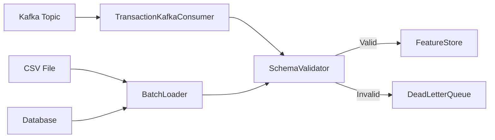

**Key Classes:**
- `SchemaValidator` — Validates 30 required numeric fields (Time, V1–V28, Amount). Rejects negative amounts.
- `BatchLoader` — Loads CSV (validates 31 columns) or DB tables. Reports null columns. Logs class distribution.
- `TransactionKafkaConsumer` — Consumes from topic, auto-reconnects in 5s, routes bad messages to DLQ.
- `FeatureStore` — In-memory versioned storage. O(1) lookup. Tracks batch metadata (source, timestamp, count).

**Usage:**
```python
from src.ingestion import SchemaValidator, BatchLoader, FeatureStore

# Load and validate
loader = BatchLoader(batch_size=10000)
df = loader.load_csv("creditcard.csv")

# Store in feature store
store = FeatureStore()
store.put_batch(records, data_source="csv", version="v1.0")
```

---

### Layer 2: Preprocessing

**Purpose:** Handle class imbalance, normalize features, remove correlated features, and split data.

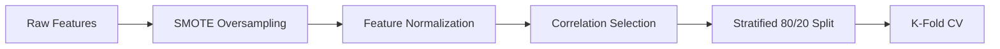

**Pipeline Order:**
1. **SMOTE** — Oversample fraud class to configurable ratio (default 1:1). Only on training split.
2. **Normalization** — StandardScaler (mean=0, std=1) or MinMaxScaler ([0,1]). Fit on train only.
3. **Correlation Selection** — Remove features with |r| > 0.95. Keep higher-variance feature.
4. **Stratified Split** — 80/20 preserving class ratio ±1%. K-fold CV (k=2–20) with ±2% tolerance.

**Usage:**
```python
from src.preprocessing import SMOTEResampler, FeatureNormalizer, StratifiedSplitter

splitter = StratifiedSplitter()
splits = splitter.split(X, y, test_size=0.2, random_seed=42)

resampler = SMOTEResampler(target_ratio=1.0)
X_train_bal, y_train_bal = resampler.resample(splits.X_train, splits.y_train)

normalizer = FeatureNormalizer(scaler_type="StandardScaler")
X_train_norm = normalizer.fit_transform(X_train_bal)
X_test_norm = normalizer.transform(splits.X_test)
```

---

### Layer 3: Ensemble ML

**Purpose:** Train three gradient-boosted models and combine via soft-voting for superior fraud detection.

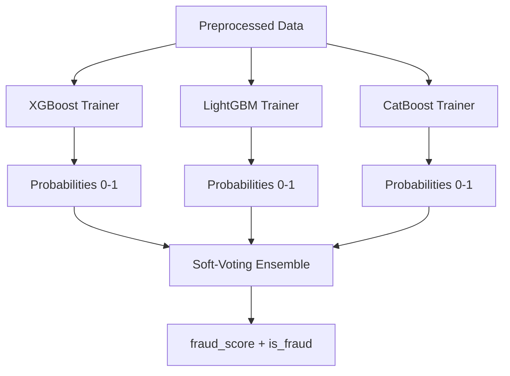

**Hyperparameter Validation:**
| Model | Parameter | Valid Range |
|-------|-----------|-------------|
| XGBoost | learning_rate | (0.0, 1.0] |
| XGBoost | max_depth | [1, 50] |
| XGBoost | n_estimators | [1, 10000] |
| LightGBM | num_leaves | [2, 131072] |
| CatBoost | depth | [1, 16] |
| CatBoost | iterations | [1, 10000] |

**Soft-Voting Formula:**
```
fraud_score = w_xgb × P_xgb + w_lgb × P_lgb + w_cb × P_cb
is_fraud = (fraud_score >= threshold)
```

**Usage:**
```python
from src.ensemble import XGBoostTrainer, LightGBMTrainer, CatBoostTrainer, SoftVotingEnsemble

xgb = XGBoostTrainer(learning_rate=0.1, max_depth=6, n_estimators=300)
lgb = LightGBMTrainer(learning_rate=0.1, num_leaves=31, n_estimators=300)
cb = CatBoostTrainer(learning_rate=0.1, depth=6, iterations=300)

xgb_result = xgb.train(X_train, y_train)
lgb_result = lgb.train(X_train, y_train)
cb_result = cb.train(X_train, y_train)

ensemble = SoftVotingEnsemble(weights={"xgboost": 0.4, "lightgbm": 0.35, "catboost": 0.25})
predictions = ensemble.predict_batch({
    "xgboost": xgb_result.probabilities,
    "lightgbm": lgb_result.probabilities,
    "catboost": cb_result.probabilities,
}, y_true=y_test)
```

---

### Layer 4: Explainable AI

**Purpose:** Provide global and local model explanations for transparency and regulatory compliance.

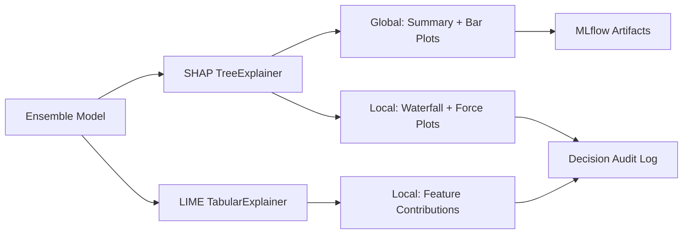

**SHAP Explanations:**
- **Global** — Summary plot (all features ranked by mean |SHAP|) + Bar plot (top-N features)
- **Local** — Per-transaction waterfall and force plots showing positive/negative feature contributions

**LIME Explanations:**
- Trains local surrogate with 5000 perturbation samples (configurable 1000–50000)
- Returns top-N features (1–30) with fidelity score (R²)
- Flags low-confidence explanations when R² < 0.6

**Decision Audit Log:**
- Append-only (rejects update/delete with "operation not permitted")
- Records: transaction_id, ISO 8601 timestamp (ms precision), model_version, fraud_score, is_fraud, top-5 SHAP
- 7-year retention for financial compliance
- Query by ID within 200ms
- Retry queue (3 attempts + exponential backoff) on storage failure

---

### Layer 5: MLflow Management

**Purpose:** Track experiments, manage model lifecycle, compare metrics, and provide distributed tracing.

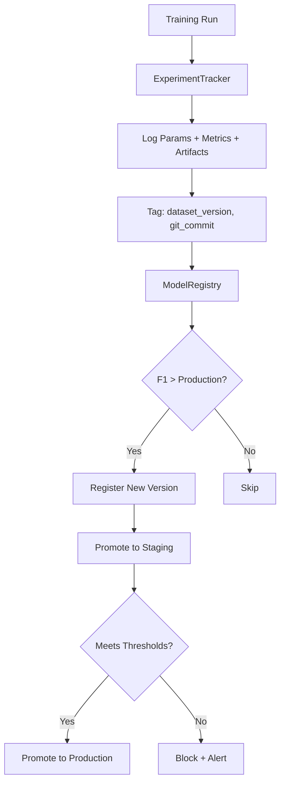

**Promotion Thresholds (Default):**
| Metric | Minimum |
|--------|---------|
| F1 Score | ≥ 0.85 |
| AUC-ROC | ≥ 0.90 |
| Precision | ≥ 0.80 |
| Recall | ≥ 0.75 |

**Model Stages:** None → Staging → Production (previous Production archived to None on new promotion)

---

### Layer 6: FastAPI Serving

**Purpose:** Serve fraud predictions and explanations via REST API with auth and rate limiting.

**Endpoints:**

| Method | Path | Description | Auth | Latency Target |
|--------|------|-------------|------|----------------|
| POST | `/predict` | Fraud score + classification | ✅ | p95 < 200ms |
| POST | `/explain` | SHAP values + base_value | ✅ | p95 < 500ms |
| GET | `/health/live` | Liveness probe | ❌ | p95 < 50ms |
| GET | `/health/ready` | Readiness probe | ❌ | p95 < 50ms |

**Security:**
- API key auth via `X-API-Key` header (HTTP 401 if missing/invalid)
- Fixed-window rate limiting per key (default: 100 req/60s)
- Rate limit headers: `X-RateLimit-Limit`, `X-RateLimit-Remaining`
- HTTP 429 + `Retry-After` when exceeded

---

### Layer 7: AIOps Monitoring

**Purpose:** Detect model degradation, alert the team, and trigger automated retraining.

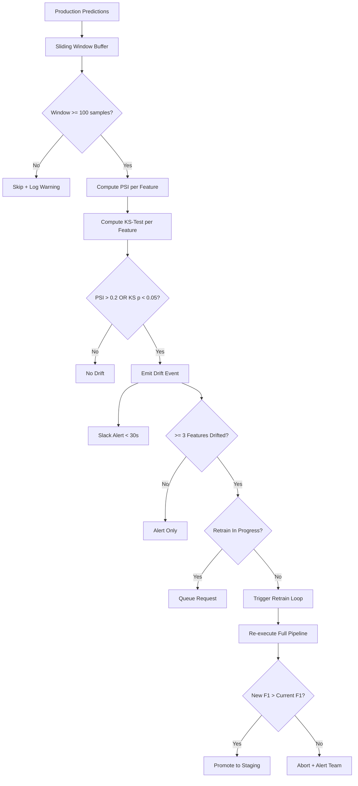

**Prometheus Metrics Exported:**
- `prediction_count` (Counter)
- `prediction_latency_seconds` (Histogram: buckets 0.01–2.5s)
- `live_f1_score` (Gauge)
- `drift_events_total` (Counter)
- `active_model_version` (Info)

**Grafana Dashboard Panels:**
- Prediction latency percentiles (p50, p95, p99)
- Live F1 score trend
- Drift event timeline
- Request throughput
- Active model version

---

## End-to-End Flow

### Training Pipeline Flow

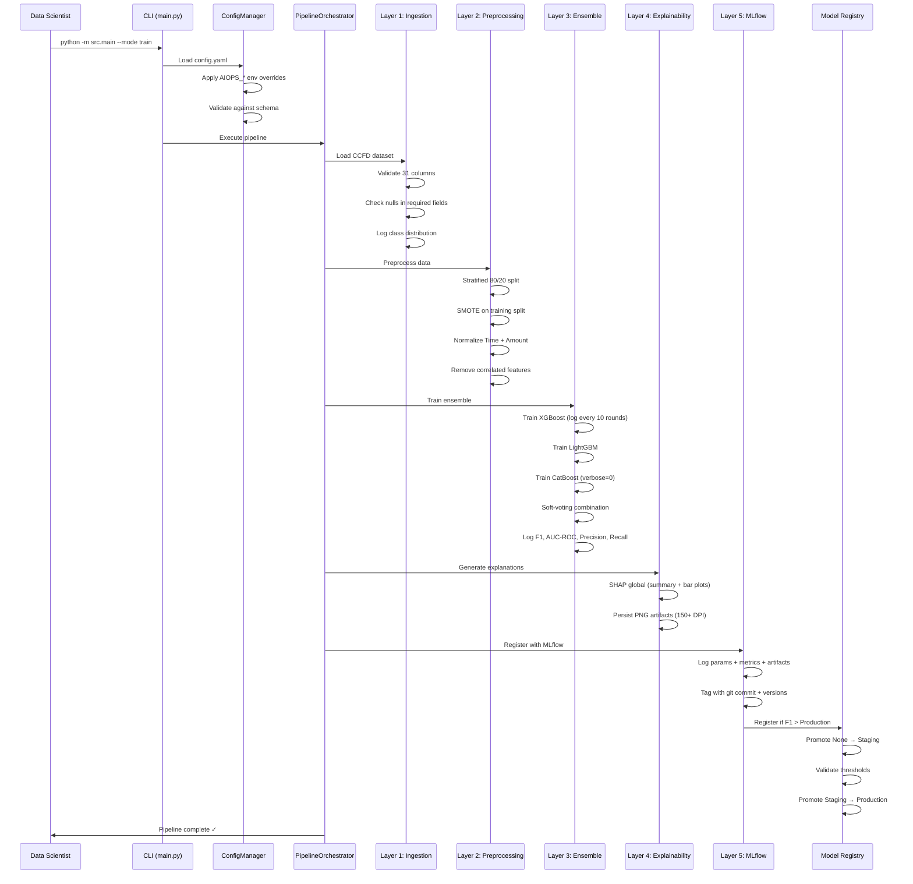

### Inference Flow (Real-Time Prediction)

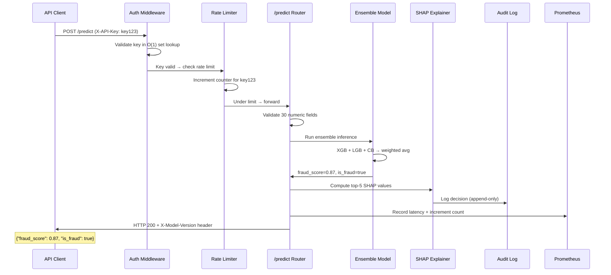

### Automated Retraining Flow

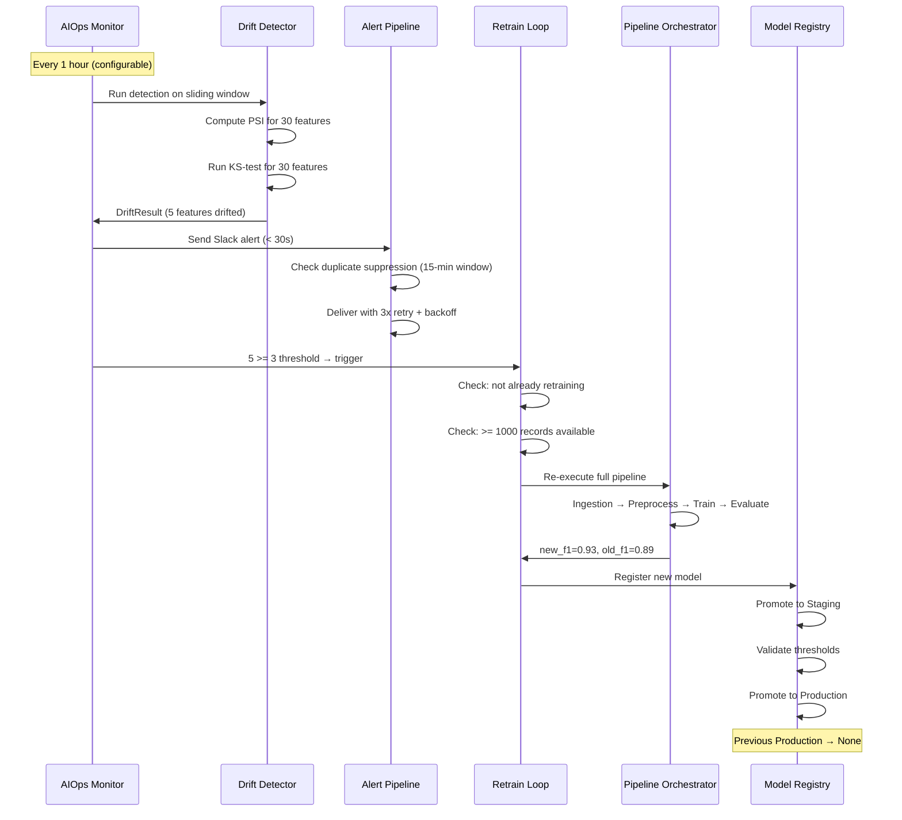

---

## User Flow Diagrams

### Data Scientist Workflow

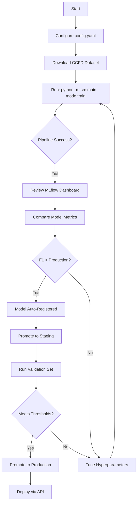

### Fraud Analyst Workflow

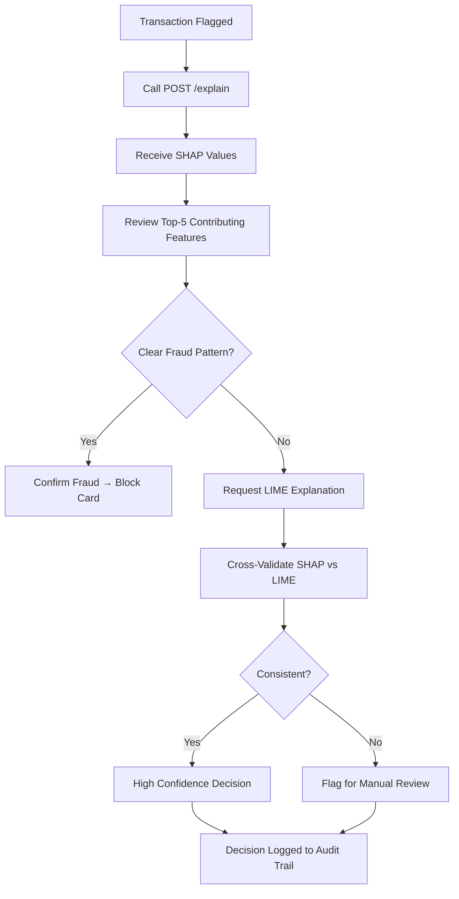

### MLOps Engineer Workflow

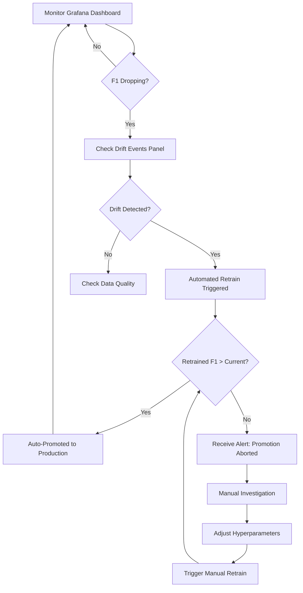

### Compliance Officer Workflow

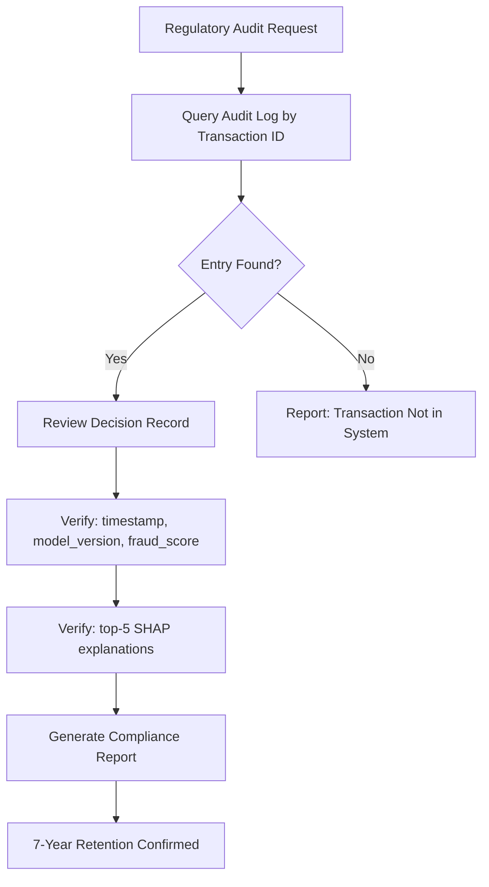

---

## API Reference

### POST /predict

**Request:**
```json
{
  "Time": 0.0,
  "V1": -1.35, "V2": -0.07, "V3": 2.53,
  "...": "...(V4-V27)",
  "V28": -0.01,
  "Amount": 149.62
}
```

**Response (200):**
```json
{
  "fraud_score": 0.023,
  "is_fraud": false,
  "model_version": "1.0.0"
}
```

**Headers:** `X-Model-Version: 1.0.0`

**Error Responses:**
- `422` — Invalid payload (field-level validation errors)
- `401` — Missing/invalid API key
- `429` — Rate limit exceeded (includes `Retry-After` header)
- `503` — Model not loaded

### POST /explain

**Response (200):**
```json
{
  "shap_values": {
    "V14": -0.32,
    "V4": 0.28,
    "V12": -0.19,
    "V10": 0.15,
    "Amount": 0.11
  },
  "base_value": 0.5,
  "fraud_score": 0.87,
  "model_version": "1.0.0"
}
```

### GET /health/live

**Response (200):** `{"status": "alive"}`

### GET /health/ready

**Response (200):** `{"status": "ready"}`
**Response (503):** `{"status": "not_ready", "failing_components": ["model"]}`

---

## Configuration

### Environment Variable Overrides

All config values can be overridden via environment variables with the `AIOPS_` prefix and `__` (double underscore) as section delimiter:

```bash
# Override preprocessing scaler type
export AIOPS_PREPROCESSING__SCALER__TYPE=MinMaxScaler

# Override API port
export AIOPS_API__PORT=9000

# Override ensemble decision threshold
export AIOPS_ENSEMBLE__VOTING__DECISION_THRESHOLD=0.7

# Override drift detection schedule (seconds)
export AIOPS_MONITORING__DRIFT__SCHEDULE_SECONDS=1800
```

### Full Configuration Schema

See `config.yaml` for the complete schema with all 8 sections: ingestion, preprocessing, ensemble, explainability, mlflow, api, monitoring, pipeline.

**Validation:** All config values are validated against type, range, and allowed-value constraints at startup. Missing required fields produce a clear error listing all violations.

---

## Testing

### Test Architecture

```
tests/
├── unit/               # 677 fast unit tests (no external dependencies)
│   ├── test_schema_validator.py      (25 tests)
│   ├── test_batch_loader.py          (20 tests)
│   ├── test_kafka_consumer.py        (20 tests)
│   ├── test_feature_store.py         (29 tests)
│   ├── test_smote_resampler.py       (14 tests)
│   ├── test_feature_normalizer.py    (25 tests)
│   ├── test_correlation_selector.py  (24 tests)
│   ├── test_stratified_splitter.py   (32 tests)
│   ├── test_xgboost_trainer.py       (33 tests)
│   ├── test_lightgbm_trainer.py      (37 tests)
│   ├── test_catboost_trainer.py      (31 tests)
│   ├── test_soft_voting_ensemble.py  (32 tests)
│   ├── test_shap_explainer.py        (32 tests)
│   ├── test_lime_explainer.py        (35 tests)
│   ├── test_decision_audit_log.py    (31 tests)
│   ├── test_drift_detector.py        (21 tests)
│   ├── test_alert_pipeline.py        (14 tests)
│   ├── test_retrain_loop.py          (17 tests)
│   ├── test_metrics_exporter.py      (21 tests)
│   ├── test_auth_middleware.py       (14 tests)
│   ├── test_rate_limiter.py          (22 tests)
│   ├── test_config_manager.py        (21 tests)
│   ├── test_models.py               (25 tests)
│   └── ...more
├── properties/         # Property-based tests (Hypothesis library)
└── integration/        # Requires live services (Kafka, MLflow, etc.)
```

### Running Tests

```bash
# All unit tests
pytest tests/unit/ -v --tb=short

# Specific layer
pytest tests/unit/test_xgboost_trainer.py tests/unit/test_lightgbm_trainer.py -v

# With coverage report
pytest tests/unit/ --cov=src --cov-report=html --cov-report=term-missing

# Property-based tests (if implemented)
pytest tests/properties/ -v --hypothesis-seed=0
```

---

## Deployment

### Docker Deployment

```dockerfile
FROM python:3.10-slim

WORKDIR /app
COPY . .
RUN pip install -e .

# Training
CMD ["python", "-m", "src.main", "--config", "config.yaml", "--mode", "train"]

# Or serving
# CMD ["python", "-m", "src.main", "--config", "config.yaml", "--mode", "serve"]
```

### Docker Compose (Full Stack)

```yaml
version: "3.9"
services:
  api:
    build: .
    command: python -m src.main --config config.yaml --mode serve
    ports:
      - "8000:8000"
    environment:
      - AIOPS_API__PORT=8000
    depends_on:
      - mlflow
      - kafka
      - prometheus

  mlflow:
    image: ghcr.io/mlflow/mlflow:latest
    ports:
      - "5000:5000"
    command: mlflow server --host 0.0.0.0

  kafka:
    image: confluentinc/cp-kafka:latest
    ports:
      - "9092:9092"

  prometheus:
    image: prom/prometheus:latest
    ports:
      - "9090:9090"
    volumes:
      - ./prometheus.yml:/etc/prometheus/prometheus.yml

  grafana:
    image: grafana/grafana:latest
    ports:
      - "3000:3000"
    volumes:
      - ./dashboards:/var/lib/grafana/dashboards
```

---

## IEEE Paper Contribution

### Core AIOps Contribution

The **automated retrain feedback loop** is the primary AIOps contribution:

1. **Drift Detection** — PSI + KS-test identifies feature distribution shifts before accuracy degrades
2. **Automated Response** — When ≥3 features drift simultaneously, full pipeline re-executes automatically
3. **Quality Gate** — Retrained model only promoted if F1 improves over production (prevents degradation)
4. **Observability** — Full OpenTelemetry tracing + Prometheus metrics provide end-to-end visibility

### Key Differentiators for Paper

| Aspect | This Framework | Traditional ML Pipelines |
|--------|---------------|------------------------|
| Retraining | Automated on drift | Manual intervention |
| Explainability | SHAP + LIME dual | Single method or none |
| Audit Trail | Immutable, 7-year retention | Often missing |
| Drift Detection | PSI + KS-test (dual statistical) | Single metric or none |
| Model Promotion | Staged with threshold gates | Direct deployment |
| Observability | OpenTelemetry traces | Log files only |

### Reproducibility

- All hyperparameters logged to MLflow with Git commit hash
- Feature store versioning enables exact dataset reproduction
- Configurable random seeds ensure deterministic splits
- Full config tracked as YAML (no hardcoded values)

---

## Technology Stack

| Category | Technology | Version |
|----------|-----------|---------|
| Language | Python | ≥ 3.10 |
| API Framework | FastAPI + Uvicorn | ≥ 0.104.0 |
| ML Models | XGBoost, LightGBM, CatBoost | ≥ 2.0, ≥ 4.1, ≥ 1.2 |
| Explainability | SHAP, LIME | ≥ 0.43, ≥ 0.2 |
| Class Balancing | imbalanced-learn (SMOTE) | ≥ 0.11 |
| Experiment Tracking | MLflow | ≥ 2.9 |
| Streaming | confluent-kafka | ≥ 2.3 |
| Monitoring | prometheus-client | ≥ 0.19 |
| Tracing | opentelemetry-sdk | ≥ 1.21 |
| Validation | Pydantic | ≥ 2.5 |
| Testing | pytest + Hypothesis | ≥ 7.4, ≥ 6.92 |
| Visualization | Grafana | Dashboard JSON |
| Alerting | Slack + PagerDuty | Webhook + Events API v2 |

---

## What's Next?

1. **Add Property-Based Tests** — Implement the 38 Hypothesis-based correctness properties from the design
2. **Integrate Real Kafka** — Connect to a live Kafka cluster for streaming transactions
3. **Deploy MLflow Server** — Set up persistent MLflow tracking with PostgreSQL backend
4. **Configure Grafana** — Import the generated dashboard JSON and connect to Prometheus
5. **Load Test** — Verify p95 latency < 200ms at 100 concurrent requests using locust/k6
6. **CI/CD Pipeline** — Automate testing, model training, and deployment via GitHub Actions
7. **Kubernetes Deployment** — Helm chart for production-grade orchestration
8. **A/B Testing** — Shadow mode for comparing candidate models against production

---

## License

MIT License. See [LICENSE](LICENSE) for details.

---

*Built with ❤️ for IEEE paper-quality fraud detection research.*
